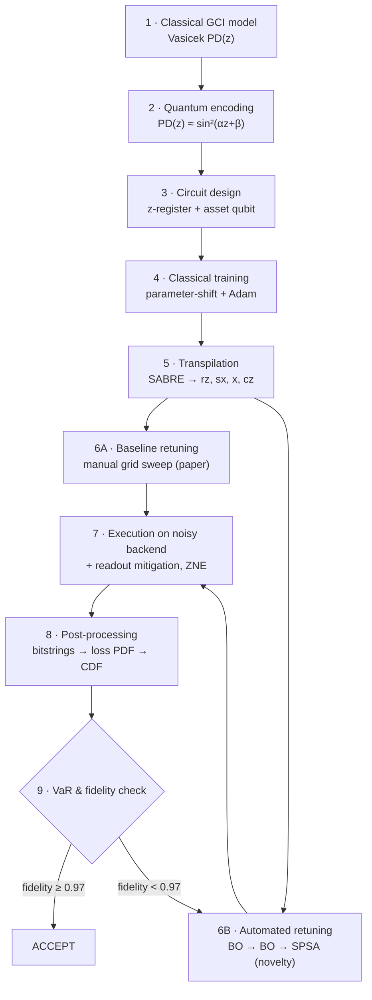
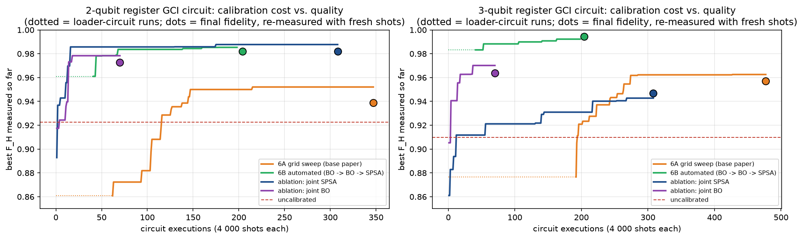
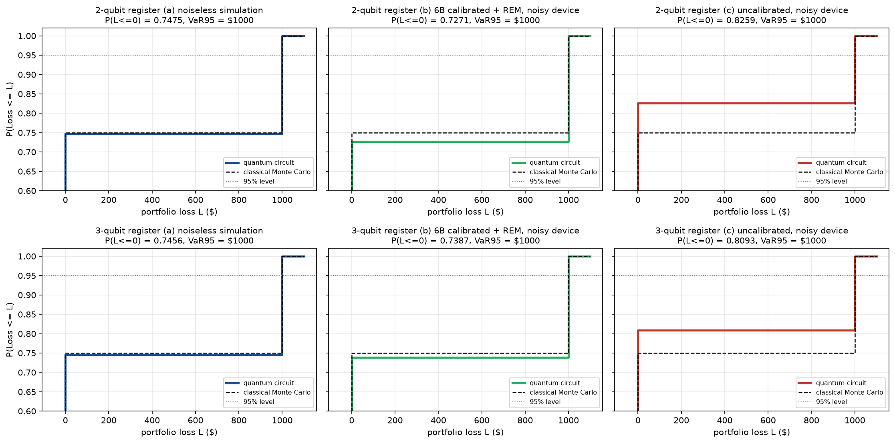

# Quantum Credit Risk on Noisy Hardware
### Hardware-Aware Variational Quantum Circuits for the GCI Credit-Risk Model — with Automated Closed-Loop Calibration

Banks estimate how much money they could lose when borrowers default. The standard model for this, the **Gaussian Conditional-Independence (GCI) / Vasicek model**, is usually evaluated with millions of classical Monte Carlo samples. Quantum computers promise a quadratic speed-up for this task, but today's chips are noisy: a circuit that is correct on paper produces the wrong distribution on real hardware.

This repository rebuilds, stage by stage, the hardware-aware quantum credit-risk circuit of
**H. G. Ahmad et al., "Quantum Circuit-Based Adaptation for Credit Risk Analysis," *IEEE Transactions on Quantum Engineering*, vol. 7, 2026** ([DOI: 10.1109/TQE.2026.3691176](https://doi.org/10.1109/TQE.2026.3691176)), runs it on a realistically noisy simulated device, and replaces the paper's manual, degree-by-degree angle tuning with an **automated calibration loop** that is more accurate, cheaper, and recalibrates itself when the device drifts.

> 📘 **New to the project?** Read [`PROJECT_OVERVIEW.md`](PROJECT_OVERVIEW.md) — a complete, study-ready explanation of the finance, the quantum computing, every stage, and every result.

---

## Highlights

| | Base paper (reproduced) | This project |
|---|---|---|
| Angle tuning on the noisy device | Manual grid sweep, one or two angles at a time | **Automated: Bayesian optimisation → Bayesian optimisation → SPSA** |
| Accuracy after tuning (Hellinger fidelity, 2-qubit / 3-qubit register) | 0.939 / 0.956 | **0.982 / 0.994** |
| Circuit executions spent on tuning | 347 / 477 | **204 / 204** |
| Error mitigation | none | **Readout mitigation + zero-noise extrapolation benchmarked** |
| Device drifts after calibration | re-sweep by hand | **Detected automatically and fixed (0.53 → 0.97, 0.68 → 0.99)** |

The replication matches the paper's headline numbers: **P(L ≤ 0) ≈ 0.75**, **P(L ≤ 1000) = 1**, **95 % VaR = $1000**, and a paper-style sweep that moves the 2-qubit loader angle from 195° to ≈ 234° (the paper measured 224°–237° on its real chip).

---

## The pipeline



| Stage | Notebook | What it does |
|---|---|---|
| 0 | `00_overview.ipynb` | Problem, base-paper gaps, algorithms (VQC, parameter-shift, Adam), project novelty |
| 1 | `01_classical_gci_model.ipynb` | Vasicek/GCI default model, discretised Gaussian targets, classical VaR baseline |
| 2 | `02_quantum_encoding.ipynb` | Linearises the default curve so it can be written as a qubit rotation |
| 3 | `03_circuit_design.ipynb` | Gaussian-loader register (R<sub>y</sub> + CNOT) plus a controlled-rotation asset qubit |
| 4 | `04_classical_training.ipynb` | Trains the loader angles with exact parameter-shift gradients and Adam |
| 5 | `05_transpilation.ipynb` | Maps the circuit to a native gate set and a limited-connectivity chip with SABRE |
| 6 | `06_hardware_retuning.ipynb` | Builds the noisy device; **6A** paper grid sweep vs **6B** automated calibration |
| 7 | `07_run_on_backend.ipynb` | 20 × 20 000-shot execution; readout mitigation and zero-noise extrapolation |
| 8 | `08_classical_postprocessing.ipynb` | Turns bitstrings into a loss distribution (reproduces the paper's Fig. 10) |
| 9 | `09_var_fidelity_check.ipynb` | VaR, Hellinger fidelities, ACCEPT / RE-CALIBRATE loop incl. a drift event |

---

## Quick start

```bash
git clone https://github.com/muthu-raam-t/quantum-credit-risk-vqc.git
cd quantum-credit-risk-vqc
python3 -m venv .venv && source .venv/bin/activate      # Windows: .venv\Scripts\activate
pip install -r requirements.txt
python run_pipeline.py
```

The full pipeline (stages 00 → 09) runs in **about 1–2 minutes on a laptop CPU** — no GPU, no IBM Quantum account, no internet needed after installation. Every notebook is executed and saved with its outputs, and all artefacts land in `results/`.

| Want to… | Run |
|---|---|
| Run everything and see the headline results in one place | open **`main.ipynb`** → *Run All* |
| Run everything from the terminal | `python run_pipeline.py` |
| Re-run only stages 6–9 | `python run_pipeline.py --from 6` |
| Run headless (no notebook outputs, fastest) | `python run_pipeline.py --mode scripts` |
| Explore one stage | open its notebook (run stages 1–5 once first) |

**Outputs**

- `results/figures/` — every plot of every stage (`stage00_…` to `stage09_…`)
- `results/FINAL_REPORT.md` — one-page summary of all results
- `results/*.json` — machine-readable output of each stage, read by the next

---

## Key results

**Calibration on the noisy device (Stage 6, full GCI circuit)**

| Register | Method | Circuit runs | Hellinger fidelity |
|---|---|---|---|
| 2-qubit | Uncalibrated (trained angles as-is) | 0 | 0.923 |
| 2-qubit | 6A grid sweep (base paper) | 347 | 0.939 |
| 2-qubit | **6B automated (this project)** | **204** | **0.982** |
| 3-qubit | Uncalibrated | 0 | 0.910 |
| 3-qubit | 6A grid sweep (base paper) | 477 | 0.957 |
| 3-qubit | **6B automated (this project)** | **204** | **0.994** |

**Execution and risk figures (Stages 7–9, 20 repetitions × 20 000 shots)**

| Pipeline | Fidelity 2q | Fidelity 3q | Expected loss 2q / 3q | 95 % VaR |
|---|---|---|---|---|
| Noiseless reference | 1.000 | 1.000 | $252.5 / $254.4 | $1000 |
| Uncalibrated, raw | 0.879 | 0.919 | $174.1 / $190.7 | $1000 |
| 6A grid + readout mitigation | 0.939 | 0.956 | $244.7 / $262.5 | $1000 |
| **6B automated + readout mitigation** | **0.982** | **0.995** | $272.9 / $261.3 | $1000 |
| 6B + readout mitigation + ZNE | 0.998 | 0.996 | $258.1 / $229.9 | $1000 |
| Classical GCI (discrete grid) | — | — | $250.4 / $250.0 | $1000 |

<p align="center">
  <br>
  <em>Calibration cost vs. quality: the automated loop (green) reaches higher fidelity with far fewer circuit runs than the paper's grid sweep (orange).</em>
</p>

<p align="center">
  <br>
  <em>Portfolio-loss CDF — noiseless circuit, calibrated noisy circuit, uncalibrated noisy circuit — against classical Monte Carlo.</em>
</p>

---

## How it works, in one paragraph per idea

**The model.** A borrower defaults with probability PD(z) that depends on the state of the economy z ~ N(0, 1). A few qubits (the *z-register*) are prepared so that measuring them gives a discretised bell curve; one extra *asset qubit* is rotated, conditioned on z, so that measuring it gives "default" with probability PD(z). Each shot of the circuit is therefore one correlated (economy, default) scenario.

**The problem.** On a real chip every rotation pulse is slightly miscalibrated (amplitude over/undershoot, phase offset), readout flips bits, and gates add noise. The angles trained on a perfect simulator no longer produce the right distribution.

**The fix (6B).** Treat the device as a black box: send angles, read back a histogram, measure the Hellinger distance to the correct distribution, and let an optimiser adjust the angles. Bayesian optimisation places the loader angles and then the asset angles with very few runs; SPSA refines all angles jointly; a verification step keeps the better candidate. The same loop re-runs automatically whenever the acceptance check in Stage 9 fails.

**The noisy device.** Qiskit Aer with depolarizing gate errors (0.2 % single-qubit, 1.5 % two-qubit), per-qubit readout errors (≈ 5 % on average) and a hidden, per-qubit coherent control drift (up to ±14 % amplitude, ±15° offset). The calibration methods never see these values — only measurement counts.

---

## Repository structure

```
├── main.ipynb                   master notebook: runs the whole pipeline, shows results
├── run_pipeline.py              master script (same, from the terminal)
├── 00_overview.ipynb … 09_var_fidelity_check.ipynb    one narrated notebook per stage
├── src/
│   ├── gci_model.py             Vasicek / GCI model                         (stage 1)
│   ├── quantum_encoding.py      sin² linearisation of PD(z)                 (stage 2)
│   ├── vqc_circuit.py           loader ansatz + full GCI circuit            (stage 3)
│   ├── parameter_shift.py       exact quantum gradients                     (stage 4)
│   ├── adam.py, training.py     optimiser and training loop                 (stage 4)
│   ├── transpilation.py         SABRE transpilation, parameterised circuits (stage 5)
│   ├── noise_model.py           depolarizing, readout and drift model       (stage 6)
│   ├── device.py                NoisyDevice — the emulated chip             (stages 6–9)
│   ├── calibration.py           grid sweep, SPSA, Bayesian optimisation     (stage 6)
│   ├── mitigation.py            readout mitigation, zero-noise extrapolation(stage 7)
│   ├── postprocessing.py        bitstrings → loss PDF, CDF, VaR             (stage 8)
│   ├── metrics.py               Hellinger fidelity / distance
│   ├── stages.py                computational core of stages 6–9
│   ├── report.py                writes results/FINAL_REPORT.md
│   └── config.py, pipeline_io.py   shared settings and file handling
├── scripts/                     headless runner for every stage
├── results/                     JSON outputs, figures/, FINAL_REPORT.md
├── images/                      architecture diagram
├── PROJECT_OVERVIEW.md          full study guide to the project
└── requirements.txt
```

All settings — model parameters, noise levels, shot counts, optimiser budgets, acceptance threshold — live in **`src/config.py`**.

---

## Requirements

Python 3.9+ · `qiskit` · `qiskit-aer` · `numpy` · `scipy` · `matplotlib` · `pylatexenc` · `jupyter` · `ipykernel` · `nbclient` · `nbformat` — all installed by `pip install -r requirements.txt`.

---

## Scope and honesty note

All results come from a **simulator with an emulated noise model**, not from a physical quantum processor. The model is the paper's proof-of-concept case: one asset and one risk factor, for which the 95 % VaR is $1000 for any reasonable distribution — as the paper itself notes, the meaningful test is how closely the *whole distribution* is reproduced, which is what the Hellinger fidelities measure.

## Reference

H. G. Ahmad, A. Sarno, M. El Bakraoui, C. Cosenza, C. Bésoin, F. Cibrario, V. Zaffaroni, G. Ranieri, R. Bertilone, V. Stasino, P. Mastrovito, F. Tafuri, D. Massarotti, L. Chabbra, D. Corbelletto, "Quantum Circuit-Based Adaptation for Credit Risk Analysis," *IEEE Transactions on Quantum Engineering*, vol. 7, Art. no. 3103316, 2026. doi: [10.1109/TQE.2026.3691176](https://doi.org/10.1109/TQE.2026.3691176)
